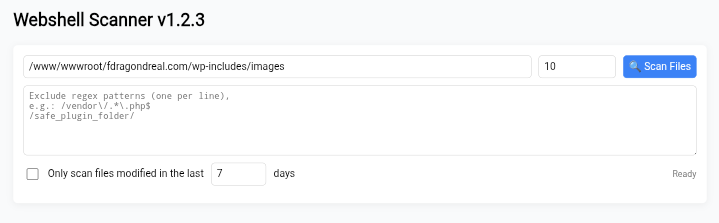

# 🔎 PHP Webshell Scanner
**Version:** 1.2.3

A lightweight, single-file PHP backdoor scanner with a simple web UI. Designed for rapid incident response and defensive security analysis.

This tool helps Blue Teams and web administrators quickly find suspicious or malicious files on a server by using a multi-layered detection approach.

---

## 🚀 Features

* **Single-File & Portable:** Just upload one file. No installation or dependencies needed.
* **Multi-Layered Detection:**
    * **Signature Matching:** Detects common malicious functions (`eval`, `system`, `passthru`, etc.).
    * **Entropy Analysis:** Catches obfuscated or encrypted code by measuring file randomness.
    * **Heuristics:** Finds suspicious filenames (e.g., `c99.php`, `wso.php`) and weak permissions (`777`).
* **Intuitive Web UI:** A clean interface to scan, review results, and take action.
* **"Analyze" Function:** Lets you inspect *why* a file was flagged, showing you the exact dangerous lines of code.
* **Quarantine:** Safely move suspicious files to a protected `quarantine` folder (which is automatically secured with an `.htaccess` file).
* **Smart Filtering:**
    * **Whitelist (Regex):** Ignore specific files or folders (like plugins/themes) to reduce false positives.
    * **Recent-Only Scan:** Massively speed up scans by only checking files modified in the last 'X' days.
    * **Auto-Ignore:** Automatically skips common safe directories (`.git`, `vendor`, `node_modules`).
* **Built-in Logging:** Automatically creates a `scan_logs` directory (also secured) to keep a history of every scan performed, perfect for incident reports.

---

## 🖼️ Screenshot

---

## 🛠️ How to Use

1.  **Download:** Download the `wsscn.php` file from this repository.
2.  **Upload:** Upload the file to the root directory (e.g., `public_html`) of the server you want to scan.
3.  **Scan:** Access the file in your browser (e.g., `http://your-website.com/webshell_scanner.php`).
    * Adjust the `path`, `whitelist`, or `recent scan` options as needed.
    * Click "🔍 Scan Files".
4.  **Review & Act:**
    * Review the list of suspicious files.
    * Click "🔍 Analyze" for a detailed, line-by-line report.
    * Click "🚫 Quarantine" to safely remove a file.
5.  **🚨 IMPORTANT! 🚨**
    * **Delete the scanner file (`webshell_scanner.php`) from your server when you are finished.** Leaving it can create a new security risk.

---

## 📜 License

This project is licensed under the **WTFPL (Do What The F*ck You Want To Public License)**. See the `LICENSE` file (or the script's header) for more details.

*"You just DO WHAT THE FUCK YOU WANT TO."*

---

## ⚠️ Disclaimer

This tool is provided for educational and defensive purposes only. The author (0x6ick) is not responsible for any misuse or damage caused by this script. Use it responsibly and ethically to secure your own assets.
